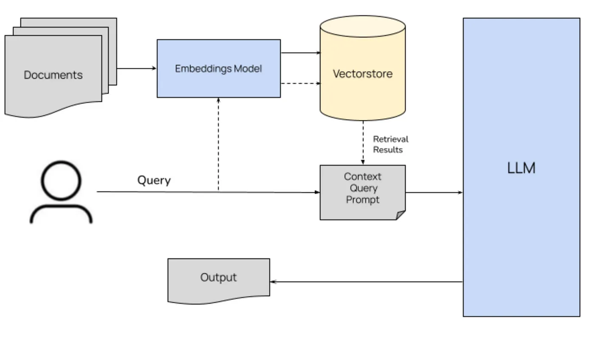

# **MedGuide Hospital Chat Assistant**

## **Overview**
The MedGuide Hospital Chatbot is an AI-powered assistant designed to provide accurate, concise, and helpful information about MedGuide Hospital, animaginary premier healthcare facility in Nairobi, Kenya. The chatbot answers questions about the hospital's services, specialties, staff, amenities, and other relevant details using a combination of **Pinecone** for vector-based search and **Meta Llama 3 70B Instruct** (via OpenRouter) for natural language understanding and response generation.

---

## **Features**
- **Accurate Information**: Uses a knowledge base of hospital information to provide accurate answers.
- **Concise Responses**: Keeps answers short and to the point (2-3 sentences).
- **List Formatting**: Formats lists clearly, with each item on its own line.
- **Streaming Responses**: Supports real-time streaming of responses for a better user experience.
- **Customizable**: Easily extendable to include additional features or integrate with other systems.

---

## **Technologies Used**
- **Frontend**: Next.js, React, Tailwind CSS
- **Backend**: Next.js API Routes
- **Vector Database**: Pinecone
- **Embedding Model**: `Xenova/all-MiniLM-L6-v2`
- **Language Model**: Meta Llama 3 70B Instruct (via OpenRouter)
- **Deployment**: Vercel

---

## **Architecture: Retrieval-Augmented Generation (RAG)**
The MedGuide Hospital Chatbot employs a Retrieval-Augmented Generation (RAG) architecture to deliver accurate and contextually relevant responses. This architecture integrates retrieval-based methods with generative models, ensuring that answers are rooted in factual information from a knowledge base. The retrieval process involves converting user queries into embeddings using the `Xenova/all-MiniLM-L6-v2` model and performing a similarity search via `Pinecone`, a vector database, to fetch the most relevant text chunks from the hospital brochure data. These retrieved chunks are then combined with the user's query to form a contextual prompt for the generative model.

The generative phase utilizes the `meta-llama/llama-3.3-70b-instruct:free` model (accessed through `OpenRouter`) to synthesize concise and accurate responses based on the retrieved context and the user's query. This RAG approach offers several benefits, including enhanced accuracy by grounding responses in factual data, improved relevance through context-aware retrieval, scalability by allowing easy updates to the knowledge base without retraining the model, and flexibility in handling a wide range of queries by leveraging the retrieved context.



---

## **Getting Started**

### **Prerequisites**
Before running the project, ensure you have the following installed:
- Node.js (v18 or higher)
- npm (v9 or higher)
- A Pinecone account (for the vector database)
- An OpenRouter API key (for the Meta Llama 3 70B Instruct model)

---

### **Installation**
1. Clone the repository:
   ```bash
   git clone https://github.com/your-username/medguide-chatbot.git
   cd medguide-chatbot
   ```

2. Install dependencies:
   ```bash
   npm install
   ```

3. Set up environment variables:
   - Create a `.env` file in the root directory:
     ```env
     PINECONE_API_KEY=your-pinecone-api-key
     OPENROUTER_API_KEY=your-openrouter-api-key
     ```
   - Replace `your-pinecone-api-key` and `your-openrouter-api-key` with your actual API keys.

4. Insert data into Pinecone:
   - Run the initialization script to insert the hospital brochure data into Pinecone:
     ```bash
     npm run init-pinecone
     ```

---

### **Running the Project**
1. Start the development server:
   ```bash
   npm run dev
   ```

2. Open your browser and navigate to:
   ```
   http://localhost:3000
   ```

3. Interact with the chatbot by typing questions in the input box.

---

## **Project Structure**
```
medguide-ai/
├── app/
│   ├── api/                  # API routes
│   │   └── route.js          # Chatbot API endpoint
│   |   └──pipeline.js        # Embedding pipeline
│   ├── page.js               # Main page component
│   └── scripts/
│       └── init-pinecone.js  # Script to insert data into Pinecone
├── public/                   # Static assets
├── styles/                   # Global styles
├── components                # UI functions
├── .gitignore                # Git ignore file
├── package.json              # Project dependencies
└── README.md                 # Project documentation
```

---

## **Configuration**
### **Environment Variables**
The following environment variables are required:

| Variable              | Description                          |
|-----------------------|--------------------------------------|
| `PINECONE_API_KEY`    | API key for Pinecone vector database |
| `OPENROUTER_API_KEY`  | API key for OpenRouter (Meta Llama 3 70B Instruct) |

---

## **Usage**
### **Chat Interface**
1. Open the application in your browser.
2. Type your question in the input box (e.g., "What services does MedGuide Hospital offer?").
3. Press **Enter** or click the **Send** button to submit your question.
4. The chatbot will respond with a concise and accurate answer.

### **Example Queries**
- **What are the visiting hours?**
  ```
  I don't know the specific visiting hours at MedGuide Hospital. However, I can tell you that the General OPD operates from Monday to Friday, 8:00 AM - 6:00 PM, and Emergency services are available 24/7.
  ```

- **Which doctors do you have at your hospital?**
  ```
  We have doctors specializing in various fields, including: - Cardiologists - Oncologists - Orthopedic surgeons - Neurologists - Dermatologists Note: For specific doctor names, I would recommend checking our website or contacting our administration for the most up-to-date information.
  ```

---

## **Deployment**
The project is designed to be deployed on **Vercel**. Follow these steps to deploy:

1. Push your code to a GitHub repository.
2. Log in to your Vercel account and create a new project.
3. Connect the GitHub repository to Vercel.
4. Add the required environment variables (`PINECONE_API_KEY` and `OPENROUTER_API_KEY`) in the Vercel dashboard.
5. Deploy the project.

---

## **Contributing**
Contributions are welcome! If you'd like to contribute, please follow these steps:
1. Fork the repository.
2. Create a new branch for your feature or bugfix:
   ```bash
   git checkout -b feature/your-feature-name
   ```
3. Commit your changes:
   ```bash
   git commit -m "Add your commit message here"
   ```
4. Push your branch:
   ```bash
   git push origin feature/your-feature-name
   ```
5. Open a pull request and describe your changes.

---

## **Acknowledgments**
- **Pinecone**: For providing the vector database.
- **OpenRouter**: For enabling access to the Meta Llama 3 70B Instruct model.
- **Xenova**: For the `all-MiniLM-L6-v2` embedding model.
- **Next.js**: For the framework.
- **Vercel**: For the serverless deployment support.

---

## **Contact**
For questions or feedback, please contact:
- **Boniface Munga**: [Email Me](mailto:mwachilumobm@gmail.com)
- **GitHub**: [MungaSoftwiz](https://github.com/MungaSoftwiz)